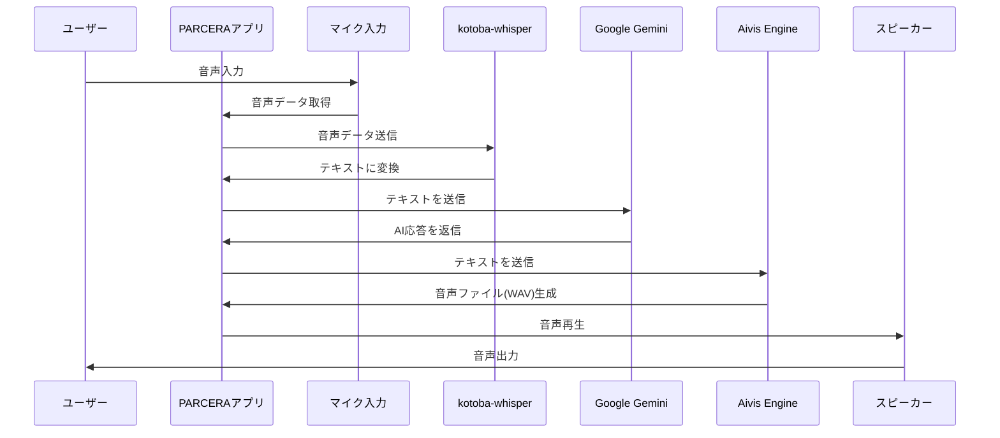

# PARCERA

PARCERAは、音声による対話型AIアシスタントアプリケーションです。ユーザーの音声入力を検知し、AIによる応答を音声で返すことで、自然な対話体験を提供します。

## 機能概要

- マイクを通じた音声入力の検知
- 音声のテキスト変換（Whisper）
- AIによる応答生成（Google Gemini）
- テキストの音声合成（Aivis Engine）
- 合成音声の再生

## 技術スタック

- 言語: Python
- パッケージマネージャー: uv
- GUI: Tkinter
- 音声認識: kotoba-whisper
- 大規模言語モデル: Google Gemini API
- 音声合成: Aivis Engine
- アプリケーションビルド: PyInstaller

## システムフロー

## 必要な環境設定

- macOS（PyInstallerによるネイティブアプリケーションとして動作）
- マイク入力デバイス
- 以下のAPIキー：
  - Google Gemini API
  - Aivis Engine API

## インストール方法

（Coming Soon）

## 使用方法

（Coming Soon）

## ライセンス

（Coming Soon）
