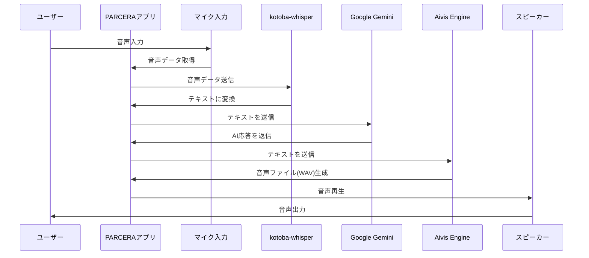

# PARCERA

PARCERAは、音声による対話型AIアシスタントアプリケーションです。ユーザーの音声入力を検知し、AIによる応答を音声で返すことで、自然な対話体験を提供します。

## 機能概要

- マイクを通じた音声入力の検知
- 音声のテキスト変換（Whisper）
- AIによる応答生成（Google Gemini）
- テキストの音声合成（Aivis Engine）
- 合成音声の再生

## 技術スタック

- 言語: Python 3.12.9
- バージョン管理: mise
- パッケージマネージャー: uv
- GUI: Tkinter
- 音声認識: kotoba-whisper
- 大規模言語モデル: Google Gemini API
- 音声合成: Aivis Engine
- アプリケーションビルド: PyInstaller

## システムフロー



## 必要な環境設定

- macOS（PyInstallerによるネイティブアプリケーションとして動作）
- マイク入力デバイス
- 以下のAPIキー：
  - Google Gemini API
  - Aivis Engine API

## インストール方法

### 開発環境のセットアップ

1. 必要な環境
   - Python 3.12.9
   - [mise](https://mise.jdx.dev/) (Pythonバージョン管理)
   - uv (パッケージマネージャー)

2. Pythonのインストール
   ```bash
   # miseを使用してPython 3.12.9をインストール
   mise install python@3.12.9
   mise use python@3.12.9
   ```

3. 環境構築
   ```bash
   # 仮想環境の作成とアクティベート
   python -m venv .venv
   source .venv/bin/activate

   # uvのインストール
   curl -LsSf https://astral.sh/uv/install.sh | sh

   # 依存関係のインストール（開発環境用）
   uv pip install -e .
   ```

4. アプリケーションの実行
   ```bash
   # 開発モードで実行
   python src/main.py
   ```

5. ビルド方法
   ```bash
   # 実行可能なアプリケーションとしてビルド
   pyinstaller --clean --onefile --windowed --collect-all tkinter --name parcera src/main.py

   # ビルドされたアプリケーションは dist/parcera に生成されます
   ```

## 依存関係の管理

プロジェクトの依存関係は`pyproject.toml`で管理されています。主な依存関係：

- pyinstaller: アプリケーションのビルドに使用
- 開発用ツール（black, isort, mypy, flake8）: コード品質の維持

新しい依存関係を追加する場合は、`pyproject.toml`の`dependencies`セクションに追加してください。

## 使用方法

（Coming Soon）

## ライセンス

（Coming Soon）
