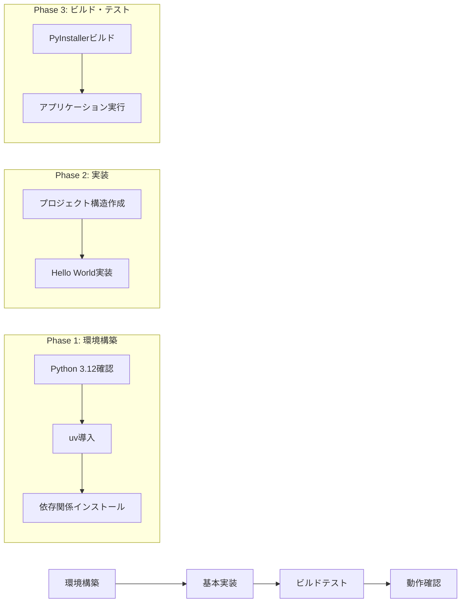

# Parcera 初期セットアップ計画

## プロジェクト構造
```
parcera/
├── src/
│   └── main.py      # メインアプリケーションコード
├── requirements.txt  # 依存関係の管理
└── scripts/
    └── build.sh     # ビルドスクリプト
```

## 環境構築ステップ
1. Python 3.12のインストール確認
2. uvのインストール
3. 仮想環境の作成と依存関係のインストール
   - tkinter
   - pyinstaller

## アプリケーション実装
```python
# main.pyの基本構造
import tkinter as tk

class ParceraApp:
    def __init__(self, root):
        self.root = root
        self.root.title("Parcera")
        # Hello World表示用のラベル
        self.label = tk.Label(root, text="Hello World!")
        self.label.pack()

def main():
    root = tk.Tk()
    app = ParceraApp(root)
    root.mainloop()

if __name__ == "__main__":
    main()
```

## ビルド設定
- PyInstallerの設定
  - ワンファイル実行形式
  - macOS用アプリケーションバンドル
  - アイコンなどの基本的なリソース設定（将来的に追加）

## 実装マイルストーン


## 次のステップ
実装フェーズに移行し、以下の順序で作業を進めます：
1. 環境構築（Python 3.12、uv）
2. プロジェクト構造の作成
3. 基本的なGUIアプリケーションの実装
4. PyInstallerによるビルドとテスト
