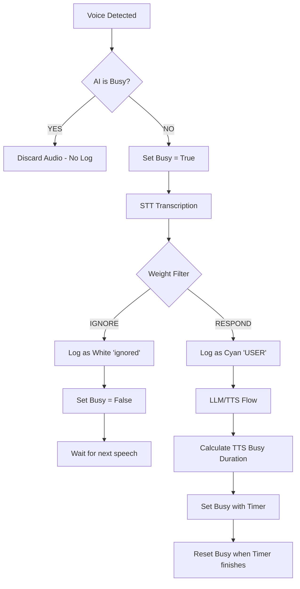

# AI Interaction Pipeline PRD

## 1. Objective
Define a resource-efficient, "First-Wins" interaction model for the Parcera AI that maintains a natural conversational rhythm without overlapping responses or unnecessary processing.

## 2. Decision Logic Specs

### 2.1 "First-Wins" Busy Strategy (The Shield)
- **Early Exit**: If the AI is currently `Busy`, incoming voice data must be discarded **before** it reaches the STT component.
- **Resource Protection**: No transcription or logging occurs for busy-discarded speech. The user is expected to observe the AI's current activity (speaking or thinking).
- **Busy States**:
  - Transcription in progress.
  - LLM "Thinking" (Prompt processing).
  - TTS Generation and Playback.

### 2.2 Immediate Flagging & Fast Release
- **Immediate Busy**: Mark as `Busy` at the very entry point of speech submission.
- **Ignore Release**: If the response filter decides to skip a response (due to low "weight"), the `Busy` flag must be released **immediately** after the decision to allow subsequent speech.

### 2.3 Intelligent Speech Weighting
- **Weight Calculation**: `Weight = Total Length + (Kanji Count * 1.0)`. (Meaningful strings where Kanji=2, Kana=1).
- **TTS Duration Estimation**:
  - Use the same Weight formula to estimate how long the AI will remain `Busy` during playback.
  - *Formula*: `Busy Duration (sec) = (Weight / 6.0) + 1.0s buffer`.

### 2.4 Diagnostic Logging (Simple Log Mode)
- **Cyan**: Active user request (Passed all filters and LLM is responding).
- **Green**: AI response text.
- **White**: User speech detected but **Ignored** by the response filter.
- **No Log**: Speech detected while `Busy`.

## 3. Interaction Flowchart

