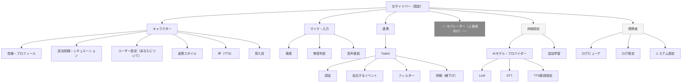

# IA仕様: UI Redesign — Information Architecture（詳細版）

- 関連PRD: `docs/specs/ui-redesign/PRD.md`
- 最終更新: 2026-04-02

---

## 1. 概要

本ドキュメントは、Parcera 設定UIのナビゲーション構造と全設定項目の情報アーキテクチャを定義する。
「ユーザーのメンタルモデルと操作頻度に基づいた Progressive Disclosure 設計」を原則とし、技術アーキテクチャをそのままラベルにした現行タブ構造を置き換える。

各セクションに含まれるすべての設定項目を網羅的に記載する。

---

## 2. UIフレームワーク

| 項目 | 決定内容 |
|------|---------|
| コンポーネントライブラリ | shadcn/ui |
| スタイリング | Tailwind CSS |
| ナビゲーション形式 | 左サイドバー（固定） |
| コンテンツ形式 | 1ページ縦スクロール（タブ・アコーディオンなし） |

---

## 3. ナビゲーション構造

### 3-1. サイドバー構成

```
キャラクター        ← 最頻繁
マイク・入力        ← 頻繁
連携               ← 初回のみ
──────────────── （セパレーター: ここから上級者向け）
詳細設定           ← 上級者向け
開発者             ← パワーユーザーのみ
```

セパレーターより上はすべての一般ユーザーが日常的に触る体験設定、セパレーターより下は技術的意思決定が必要な設定または低頻度操作。

### 3-2. ナビゲーション構造図



---

## 4. セクション別設定項目定義

### 4-1. キャラクター

AIキャラクターの人格・体験・表現に関わるすべての設定を集約するセクション。ユーザーが最も頻繁に操作する。

#### 4-1-1. 性格・プロフィール

| 設定項目 | 説明 |
|---------|------|
| 名前 | AIキャラクターの名前 |
| 種族 | キャラクターの種族（人間・エルフ・獣人 等） |
| 性別 | キャラクターの性別 |
| 性格 | どのような性格かの記述 |
| 口調 | 話し方のスタイル（例: 丁寧語・フランク・武士語） |
| 一人称 | AIが自分を指す語（私・俺・わたし 等） |
| 趣味 | キャラクターの趣味・好きなもの |

#### 4-1-2. 追加知識・シチュエーション

| 設定項目 | 説明 |
|---------|------|
| テキストエリア | AIが知っておくべき背景情報・攻略情報・現在のシチュエーション。ゲームの状況や配信の文脈など自由記述 |

#### 4-1-3. ユーザー設定（あなたについて）

| 設定項目 | 説明 |
|---------|------|
| あなたの名前 | ユーザー本人の名前 |
| AIからの呼び方 | AIがユーザーを呼ぶ際の呼称 |
| 性別 | ユーザーの性別（AIの返答に影響） |
| 対話モード | **独り言モード**（観戦者モード: AIが独り言をつぶやく） / **会話モード**（チャットモード: ユーザーとの双方向会話） |

#### 4-1-4. 返答スタイル

| 設定項目 | 説明 |
|---------|------|
| Temperature | 表現のランダム性。0.0 に近いほど安定した返答、高いほど独創的・多様な表現になる。技術パラメータではなく「おしゃべりなキャラ」「短く返すキャラ」といったキャラクター個性として扱う |

#### 4-1-5. 声

TTSの使用モデルと音声パラメーターを設定する。APIキー・エンジンURL・起動パス等の接続設定は「詳細設定 > TTS接続設定」に移動。

| 設定項目 | 説明 |
|---------|------|
| TTSプロバイダー選択 | AivisSpeech / VOICEVOX / Google Cloud TTS から選択 |
| キャラクター（音声モデル）選択 | 選択プロバイダーから取得した音声モデル一覧より選択 |
| 話速 (Speed Scale) | 音声の速度 |
| 抑揚 (Intonation Scale) | 音声の抑揚の強さ |
| ピッチ (Pitch Scale) | 音声の高さ |
| 話速の緩急 (Tempo Dynamics Scale) | 話す速度のゆらぎ。**AivisSpeech のみ表示** |
| 出力音量 (Volume Scale) | 音声の出力音量 |

#### 4-1-6. 見た目

アバター画像およびウィンドウの外観設定。デバッグ情報表示（ピークメーター・状態テキスト）は「開発者 > システム設定」に移動。

| 設定項目 | 説明 |
|---------|------|
| AIアバター画像パス | AIキャラクターのアバター画像ファイルパス |
| USERアバター画像パス | ユーザーのアバター画像ファイルパス |
| AIウィンドウ設定 | AIアバターウィンドウのサイズ・位置等 |
| USERウィンドウ設定 | ユーザーアバターウィンドウのサイズ・位置等 |
| 呼吸アニメーション設定 | アバターの呼吸アニメーションの有効化・速度等 |

---

### 4-2. マイク・入力

音声入力の認識品質に直結する設定を集約するセクション。「そもそも認識されない」問題のトラブルシューティング拠点。STTプロバイダー選択・APIキー・モデル設定は「詳細設定」に移動。

#### 4-2-1. 感度

| 設定項目 | 説明 |
|---------|------|
| 使用するマイク | 入力デバイスの選択 |
| 起動時ミュート | 起動時にマイクをミュート状態で開始するか |
| 音量閾値 (dB) | 発話と判定する最小音量レベル |

#### 4-2-2. 無音判定

| 設定項目 | 説明 |
|---------|------|
| 発話終了判定の無音時間 | この時間以上無音が続いた場合に発話終了と判定する |
| 最大録音時間 | 一発話として認識する最大時間 |

#### 4-2-3. 音声連結

| 設定項目 | 説明 |
|---------|------|
| 発話の結合待機時間 | 無音後にこの時間内に再び発話が始まった場合、前の発話と連結する |
| 無視するフレーズ | このフレーズのみの発話は処理しない（カンマ区切り） |

---

### 4-3. 連携

外部サービスとの接続設定。初回セットアップ後は変更頻度が低いが、フィルター・イベント設定は配信状況に応じて変えることがある。

#### 4-3-1. Twitch

##### 有効化

| 設定項目 | 説明 |
|---------|------|
| Twitch連携を有効にする | Twitch連携機能のON/OFFトグル |

##### 認証

| 設定項目 | 説明 |
|---------|------|
| チャンネル名 | 接続するTwitchチャンネル名 |
| OAuth接続 / 解除ボタン | OAuth認証の開始・接続解除。接続状態を表示 |

##### 反応するイベント

| 設定項目 | 説明 |
|---------|------|
| フォローに反応する | フォローイベント発生時にAIが反応するか |
| サブスクライブに反応する | サブスクライブイベント発生時にAIが反応するか |
| レイドに反応する | レイドイベント発生時にAIが反応するか |

> 接続中は各イベント行にテストボタンを表示し、実際のイベントを発火せずに動作確認できる。

##### フィルター

| 設定項目 | 説明 |
|---------|------|
| Wake Word | このパターンに一致するチャットのみAIが反応する（正規表現） |
| 無視するユーザー | 反応しないユーザー名（カンマ区切り） |
| NGワード | このパターンを含むチャットは無視する（正規表現、カンマ区切り） |

##### 詳細

セパレーターで視覚的に格下げ。通常使用では非表示を推奨するが、折りたたみではなくスクロールで到達できる。

| 設定項目 | 説明 |
|---------|------|
| 反応までの待ち時間 | なし / 短め / 標準 / 長め から選択 |
| 同一ユーザーのクールダウン（秒） | 同じユーザーへの連続反応を防ぐ待機時間 |
| 全体のクールダウン（秒） | すべてのユーザーを対象とした反応間隔の最小値 |
| キューの最大数 | 未処理の反応キューに溜める上限数 |
| メッセージの有効期限（秒） | キュー内メッセージの有効時間。期限切れは破棄 |

---

### 4-4. 詳細設定（上級者向け）

モデル・プロバイダーの技術的選択や、接続エンドポイントの設定を行うセクション。サイドバーのセパレーター以下に位置する。

#### 4-4-1. AIモデル・プロバイダー

##### LLM

| 設定項目 | 説明 |
|---------|------|
| プロバイダー選択 | Google Gemini / OpenAI / Local Brain から選択 |
| APIキー | 選択プロバイダーのAPIキー |
| モデル選択 | APIから取得したモデル一覧より選択 |
| 文章の分割文字数 | TTSへのストリーミング受け渡し単位（文字数） |
| 会話履歴の保持 | セッションを越えて会話履歴（記憶）を保持するか |

##### STT

マイク・入力セクションからプロバイダー関連設定を移動。

| 設定項目 | 説明 |
|---------|------|
| プロバイダー選択 | faster-whisper / Moonshine / Google Cloud Speech / Azure Speech から選択 |
| プロバイダー固有設定 | 選択プロバイダーに応じて表示（APIキー・モデル・デバイス 等） |

##### TTS接続設定

声セクションから接続関連設定を移動。

| 設定項目 | 説明 |
|---------|------|
| エンジンのAPI URL（AivisSpeech） | AivisSpeechエンジンへの接続URL |
| エンジンのAPI URL（VOICEVOX） | VOICEVOXエンジンへの接続URL |
| エンジン起動パス（AivisSpeech） | AivisSpeechの実行ファイルパス |
| エンジン起動パス（VOICEVOX） | VOICEVOXの実行ファイルパス |
| Google Cloud TTS APIキー | Google Cloud TTS使用時のAPIキー |

#### 4-4-2. 追加学習（Mac / Apple Silicon 専用）

LoRAファインチューニングによる追加学習のワークフロー。Mac / Apple Silicon 環境でのみ表示。

##### Step 1: 知識の入力

| 操作・項目 | 説明 |
|-----------|------|
| テキスト入力 | 学習させたい知識をテキスト直接入力 |
| URL入力 | 参照URLを入力し、AIが解析してデータ生成 |

##### Step 2: データの編集

AI解析により生成された学習データを確認・修正する。

| 操作 | 説明 |
|------|------|
| OK | 生成データをそのまま採用 |
| 修正 | 内容を編集してから採用 |
| 除外 | このデータを学習から除外 |
| 保持 | 既存の学習済みデータを維持 |

##### Step 3: 学習の実行

| 操作・項目 | 説明 |
|-----------|------|
| 学習開始ボタン | LoRAファインチューニングを実行 |
| 進捗バー | 学習の進捗を表示 |
| ステータス表示 | 現在の処理状態（待機中 / 学習中 / 完了 / エラー）を表示 |

##### プロファイル管理

| 設定項目 | 説明 |
|---------|------|
| プロファイル名 | 学習プロファイルの名称変更 |

---

### 4-5. 開発者（パワーユーザー向け）

ログ確認・システムデバッグのためのセクション。一般ユーザーの導線に出さない。サイドバーのセパレーター以下の最下部。

#### 4-5-1. ログビューア

| 機能・項目 | 説明 |
|-----------|------|
| リアルタイムログ表示 | Pythonエンジンからのストリーミングログをリアルタイム表示 |
| 色分け表示 | USER / AI / Twitch / エラー等のログ種別を色で区別 |
| 表示ログクリアボタン | ビューアに表示中のログをクリア（ファイル削除ではない） |

#### 4-5-2. ログ設定

| 設定項目 | 説明 |
|---------|------|
| ログ出力レベル | INFO / WARNING / ERROR / DEBUG から選択 |
| シンプルログモード | 会話ログのみ表示（技術ログを非表示） |
| パフォーマンス計測ログ表示 | `[PERF]` プレフィックスのパフォーマンスログを表示するか |

#### 4-5-3. システム設定

| 設定項目 | 説明 |
|---------|------|
| WebSocketポート番号 | 内部通信用ポート番号。**変更後は再起動が必要** |
| 内部音声サンプリングレート (Hz) | 内部処理で使用するオーディオのサンプリングレート |
| GPUアクセラレーション | GPU使用有無。OBSキャプチャ問題のトラブルシューティング用途 |
| デバッグ情報表示 | アバターウィンドウへのピークメーター・状態テキストの表示（旧VisualTabから移動） |

---

## 5. Progressive Disclosure テーブル

| 設定項目 | 操作頻度 | 配置セクション |
|---------|---------|--------------|
| 性格・口調・プロフィール | 高 | キャラクター > 性格・プロフィール |
| 追加知識・シチュエーション | 中〜高 | キャラクター > 追加知識・シチュエーション |
| ユーザー設定（名前・呼び方・対話モード） | 中 | キャラクター > ユーザー設定 |
| Temperature | 高 | キャラクター > 返答スタイル |
| 声（音声モデル・パラメーター） | 中〜高 | キャラクター > 声 |
| 見た目（アバター・ウィンドウ・アニメーション） | 中 | キャラクター > 見た目 |
| マイク感度・無音判定・音声連結 | 高 | マイク・入力 |
| Twitch有効化・認証・イベント | 低（初回） | 連携 > Twitch |
| Twitchフィルター（Wake Word・NGワード） | 中 | 連携 > Twitch > フィルター |
| Twitchクールダウン・キュー・有効期限 | 低 | 連携 > Twitch > 詳細 |
| LLMプロバイダー・モデル・APIキー | 低 | 詳細設定 > LLM |
| LLM文章分割・会話履歴 | 低 | 詳細設定 > LLM |
| STTプロバイダー・固有設定 | 低 | 詳細設定 > STT |
| TTS接続URL・起動パス・APIキー | 低（初回） | 詳細設定 > TTS接続設定 |
| 追加学習（データ生成・LoRA実行） | 低 | 詳細設定 > 追加学習 |
| ログビューア・ログ設定 | ごく一部 | 開発者 > ログビューア / ログ設定 |
| WebSocketポート・サンプリングレート | 低 | 開発者 > システム設定 |
| GPUアクセラレーション | 低（トラブル時） | 開発者 > システム設定 |
| デバッグ情報表示（ピークメーター） | 低 | 開発者 > システム設定 |

---

## 6. 設計根拠

### キャラクター
性格・声・見た目・返答スタイルはユーザーの頭の中で「同じキャラクターの設定」として一体に認識される。
Temperature も技術パラメータではなく「おしゃべりなキャラ」「短く返すキャラ」というキャラクター個性として捉えられるため、このセクションに含める。

### マイク・入力
トラブルシューティング経路の一致を重視した分割。「そもそも認識されない」という問題はここで解決し、「認識されているが反応がおかしい」はキャラクター設定の問題として区別する。ユーザーが問題を切り分ける単位とセクション分割を一致させることで、設定箇所を探す認知負荷を下げる。
STTプロバイダー選択は技術的意思決定であり低頻度のため詳細設定へ移動。

### 連携
初回セットアップ後は変更頻度が低い。ただしフィルター・イベント設定は配信状況に応じて変えることがあり、通常ナビゲーション内に留める。Twitchクールダウン・キュー設定は上記よりさらに低頻度かつ細かい調整のため、セパレーターで格下げした「詳細」エリアに配置する。

### 詳細設定（セパレーター以下）
Progressive Disclosure の核。モデル・プロバイダー選択は技術的意思決定であり操作頻度は低い。一般ユーザーの通常操作フローに露出させる必要がなく、セパレーター以下に配置することで視覚的に格下げする。

### 開発者
ログはごく一部のパワーユーザー向けであり、一般ユーザーの導線に出さない。セパレーター以下の最下部に配置し、通常の設定操作とは明確に分離する。GPUアクセラレーションはトラブル時のみ触る設定であり、同セクションに集約する。

---

## 7. 現行タブとの対応表

| 現行タブ | 移動先 |
|---------|-------|
| キャラクター設定（AIProfile） | キャラクター > 性格・プロフィール |
| 思考・返答（LLM）— プロンプト系 | キャラクター > 性格・プロフィール |
| 思考・返答（LLM）— Temperature | キャラクター > 返答スタイル |
| 思考・返答（LLM）— モデル選択・APIキー | 詳細設定 > LLM |
| 音声出力（TTS）— 音声モデル・パラメーター | キャラクター > 声 |
| 音声出力（TTS）— 接続URL・起動パス・APIキー | 詳細設定 > TTS接続設定 |
| アバター設定（Visual）— アバター・ウィンドウ | キャラクター > 見た目 |
| アバター設定（Visual）— デバッグ情報表示 | 開発者 > システム設定 |
| 音声認識（STT）— 感度・無音判定・音声連結 | マイク・入力 |
| 音声認識（STT）— プロバイダー選択・固有設定 | 詳細設定 > STT |
| Twitch連携 | 連携 > Twitch |
| システム | 開発者 > システム設定 |
| ログ | 開発者 > ログビューア / ログ設定 |

---

## 8. 非目標（Non-Goals）

- 現行UIのデザイン（色・コンポーネント）の踏襲
- モバイル対応
- Tauri移行（将来的な検討事項。本specの対象外）

---

## 9. 未決事項

- [x] 各セクション内の具体的なレイアウト（グリッド・カラム数・フォーム幅）
  → ウィンドウ 880×800px、サイドバー 200px、コンテンツ 680px（実効 600px）。フルwidth・2カラム・Sliderインライン数値のグリッドルールを確定。詳細は「10. ビジュアル仕様」参照。
- [x] shadcn/ui コンポーネントの具体的な割り当て（Slider / Select / Switch 等）
  → 入力種別ごとのコンポーネント対応を確定。Switch / Select / Slider / Input / Textarea / Card / Button / Progress / Badge / Separator を割り当て済み。詳細は「10. ビジュアル仕様」参照。
- [x] カラーテーマ・ダークモード設定
  → ウォームダーク（Raycast / Arc 系）に決定。stone-950 背景・amber-500 アクセントの 5 色パレットを確定。shadcn/ui CSS 変数ベースのため `globals.css` 1〜2 行変更で全体反映可能。
- [x] 「詳細設定」セパレーターの視覚表現（ラベルテキスト・区切り線スタイル）
  → ラベルつき区切り線（案 A）を採用。ラベルテキスト「高度な設定」。`Separator` コンポーネント + 小さく薄いテキストラベルで実装。
- [x] サイドバーのアクティブ状態とスクロール位置の連動仕様（スクロールスパイ有無）
  → スクロールスパイは不採用。サイドバークリックでそのセクション全体をページ切り替え表示する方式に確定。サブセクションのスクロール追従は不要な複雑さを持ち込むため排除。
- [x] 連携 > Twitch「詳細」エリアの視覚的実装（インライン表示 or 折りたたみ）
  → 常時表示（折りたたみなし）に確定。少し暗い背景色の `Card` + 小さく薄い「詳細」ラベルで視覚的格下げ。アコーディオン不採用方針に従い、セパレーターとカード背景色で区別する。

---

## 10. ビジュアル仕様

### 10-1. ウィンドウ・レイアウト寸法

| 要素 | サイズ |
|------|-------|
| ウィンドウ全体 | 880 × 800 px（現行 600×800 から拡張） |
| サイドバー幅 | 200 px |
| コンテンツエリア幅 | 680 px |
| コンテンツ実効幅（padding 込み） | 600 px |

### 10-2. グリッドルール

| レイアウト種別 | 適用対象 |
|-------------|---------|
| フルwidth（1 カラム） | 長いテキスト入力・Select・Textarea・Slider |
| 2 カラム | 短い関連フィールドのペア（種族 / 性別、話速 / 抑揚 等） |
| Slider（フルwidth） | フルwidth + 右端に数値インライン表示 |
| Switch | ラベル左・Switch 右（shadcn 標準レイアウト） |

### 10-3. セクション別カラム指定

| セクション | フィールド | レイアウト |
|-----------|-----------|-----------|
| キャラクター > 性格・プロフィール | 名前 / 性格 / 口調 | フルwidth |
| キャラクター > 性格・プロフィール | 種族 + 性別 | 2 カラム |
| キャラクター > 性格・プロフィール | 一人称 + 趣味 | 2 カラム |
| キャラクター > ユーザー設定 | 名前 + 呼び方 | 2 カラム |
| キャラクター > ユーザー設定 | 性別 + 対話モード | 2 カラム |
| キャラクター > 声 | プロバイダー / モデル | フルwidth |
| キャラクター > 声 | 話速 + 抑揚 | 2 カラム Slider |
| キャラクター > 声 | ピッチ + 音量 | 2 カラム Slider |
| キャラクター > 声 | 話速の緩急 | フルwidth（AivisSpeech のみ表示） |
| キャラクター > 見た目 | AI パス + USER パス | 2 カラム |
| キャラクター > 見た目 | AI ウィンドウ + USER ウィンドウ | 2 カラム |
| キャラクター > 見た目 | 呼吸アニメーション | フルwidth |
| 連携 > Twitch 詳細 | クールダウン（ユーザー）+ クールダウン（全体） | 2 カラム |
| 連携 > Twitch 詳細 | キュー最大数 + 有効期限 | 2 カラム |

### 10-4. shadcn/ui コンポーネント対応表

| 入力種別 | コンポーネント | 備考 |
|---------|--------------|------|
| ON/OFF トグル全種 | `Switch` | ラベル左・Switch 右 |
| プロバイダー選択・モード選択・モデル選択・ログレベル等 | `Select` | |
| 視覚的な量を示すパラメーター（Temperature・話速・抑揚・ピッチ・音量・dB・時間） | `Slider` | フルwidth + 右端数値インライン表示 |
| 広範囲の数値（クールダウン秒・ポート番号・キュー数等） | `Input` type="number" | |
| 短いテキスト（名前・口調・URL・フレーズ等） | `Input` | |
| API キー | `Input` type="password" | + 表示トグルボタン |
| 長文（追加知識・シチュエーション） | `Textarea` | |
| ファイルパス | `Input` + `Button`（参照） | |
| 設定グループ区切り | `Card` + `CardHeader` + `CardContent` | |
| アクション | `Button` | variant: default / outline / destructive / ghost |
| 追加学習進捗 | `Progress` | |
| 接続状態・ステータス | `Badge` | |
| サイドバーセパレーター | `Separator` + ラベルテキスト | |

### 10-5. カラーパレット

テーマ方向性: ウォームダーク（Raycast / Arc 系）

| 役割 | Tailwind トークン | カラーコード |
|------|-----------------|------------|
| 背景 | stone-950 | `#1c1917` |
| カード / サーフェス | stone-800 | `#292524` |
| ボーダー | stone-700 | `#44403c` |
| テキスト | stone-200 | `#e7e5e4` |
| アクセント | amber-500 | `#f59e0b` |

shadcn/ui の CSS 変数ベース設計により、`globals.css` の 1〜2 行変更で全体テーマへ反映可能。

### 10-6. セパレーター仕様

| 箇所 | 形式 | ラベルテキスト | 実装 |
|------|------|--------------|------|
| サイドバー（上級者向け区切り） | ラベルつき区切り線 | 「高度な設定」 | `Separator` + 小さく薄いテキストラベル |
| 連携 > Twitch 詳細エリア | 格下げカード | 「詳細」 | 暗い背景色の `Card` + 小さく薄いラベル |
