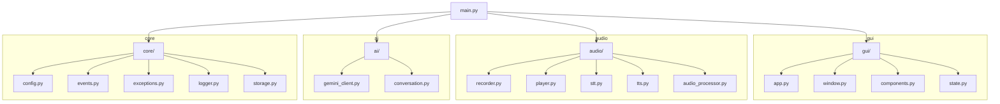
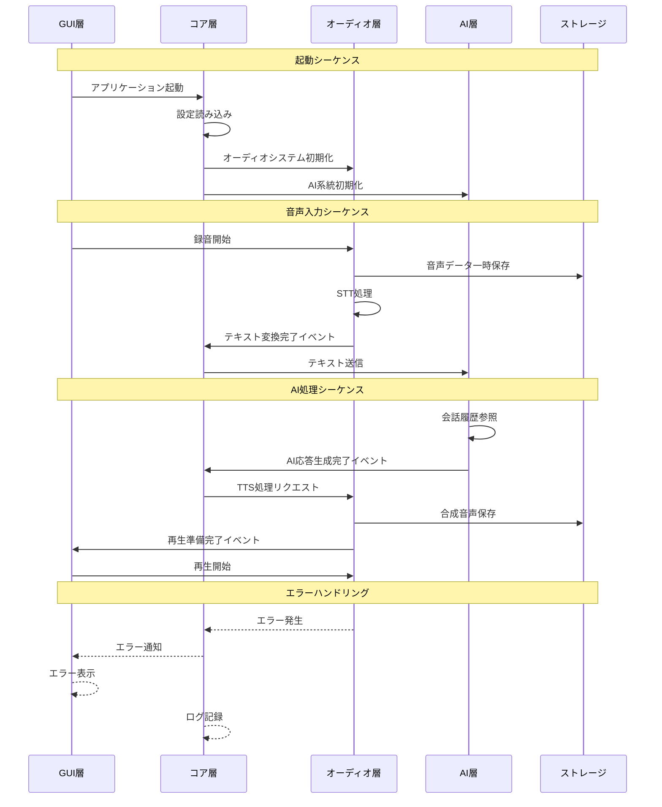

# 技術設計書

## モジュール構成



## 各モジュールの役割

### GUI層
- **app.py**: アプリケーションのメインウィンドウとイベントループの管理
- **window.py**: Tkinterを使用したメインウィンドウの定義
- **components.py**: 再利用可能なUIコンポーネント
- **state.py**: GUIの状態管理（録音中、処理中などの状態）

### オーディオ層
- **recorder.py**: マイク入力の制御と音声データの取得
- **player.py**: 音声ファイルの再生制御
- **stt.py**: Speech to Text（音声認識）処理
- **tts.py**: Text to Speech（音声合成）処理
- **audio_processor.py**: 音声データの前処理・後処理

### AI層
- **gemini_client.py**: Google Gemini APIとの通信
- **conversation.py**: 会話履歴の管理と文脈の保持

### コア層
- **config.py**: 設定ファイルの読み込みと管理
- **events.py**: イベントバスシステム（モジュール間通信）
- **exceptions.py**: カスタム例外の定義
- **logger.py**: ログ管理
- **storage.py**: 一時ファイルと永続化データの管理

## データフロー



## エラーハンドリング

### 想定されるエラー
1. マイク入力の失敗
   - デバイス未接続
   - デバイスアクセス権限なし
   - デバイス使用中
2. STT処理の失敗
   - 音声認識エラー
   - 認識精度不足
3. AI処理の失敗
   - API制限
   - 不適切なリクエスト
   - タイムアウト
4. TTS処理の失敗
   - エンジンエラー
   - 不適切なテキスト
   - ファイル書き込みエラー
5. 音声再生の失敗
   - デバイスエラー
   - ファイル形式エラー

### エラー処理方針
```python
# exceptions.py
class ParceraError(Exception):
    """基底エラークラス"""
    pass

class AudioError(ParceraError):
    """音声関連エラー"""
    pass

class AIError(ParceraError):
    """AI関連エラー"""
    pass

class StorageError(ParceraError):
    """ストレージ関連エラー"""
    pass

# エラーハンドリング例
try:
    await audio_processor.process()
except AudioError as e:
    logger.error(f"音声処理エラー: {e}")
    event_bus.emit("error", {
        "type": "audio",
        "message": str(e),
        "recoverable": True
    })
    # 自動リカバリーの試行
    await audio_processor.retry()
```

## 設定ファイル
```yaml
# config.yaml
app:
  name: PARCERA
  version: 1.0.0
  temp_dir: ./temp
  max_history: 10

audio:
  input_device: default
  sample_rate: 44100
  channels: 1
  chunk_size: 1024
  silence_threshold: 0.03
  silence_duration: 1.0
  temp_format: wav

stt:
  model: "base"
  language: "ja"
  device: "cuda" # or "cpu"

tts:
  engine_path: "./lib/tts_engine"
  voice: "default"
  output_format: "wav"

api:
  gemini:
    api_key: "${GEMINI_API_KEY}"
    timeout: 30
    max_tokens: 1000
    temperature: 0.7

storage:
  conversation_file: data/conversations.json
  temp_cleanup_interval: 3600

logging:
  level: INFO
  file: logs/parcera.log
  max_size: 10MB
  backup_count: 5
```

## 開発環境要件

### システム要件
- macOS 12.0以降
- Python 3.9以降
- uv パッケージマネージャー

### 必要なシステムライブラリ
- PortAudio（音声入出力用）
- FFmpeg（音声処理用）

### 主要な依存パッケージ
```toml
[project]
name = "parcera"
version = "1.0.0"
description = "音声対話型AIアシスタント"
requires-python = ">=3.9"
dependencies = [
    "tkinter",
    "sounddevice",
    "numpy",
    "google-generativeai",
    "pyyaml",
    "requests",
    "python-dotenv",
]

[build-system]
requires = ["hatchling"]
build-backend = "hatchling.build"

[tool.pyinstaller]
hookspath = ["hooks"]
```

## モジュール間の通信（イベントシステム）

```python
class EventTypes:
    RECORDING_START = "recording_start"
    RECORDING_STOP = "recording_stop"
    STT_COMPLETE = "stt_complete"
    AI_RESPONSE = "ai_response"
    TTS_COMPLETE = "tts_complete"
    PLAYBACK_START = "playback_start"
    PLAYBACK_COMPLETE = "playback_complete"
    ERROR = "error"

class EventBus:
    def __init__(self):
        self._handlers = {}

    def subscribe(self, event_type: str, handler: callable):
        if event_type not in self._handlers:
            self._handlers[event_type] = []
        self._handlers[event_type].append(handler)

    def emit(self, event_type: str, data: dict = None):
        if event_type in self._handlers:
            for handler in self._handlers[event_type]:
                handler(data)
